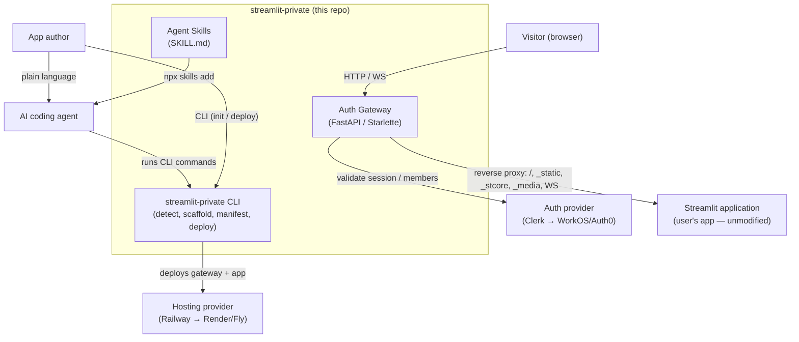

# Architecture

`streamlit-private` is two things that share a manifest: a **CLI** that scaffolds and deploys,
and an **auth gateway** that runs in production in front of the user's Streamlit app. The CLI
detects/creates a Streamlit project, writes a `streamlit-private.yaml` manifest plus
deployment assets, and deploys the gateway-fronted app to a managed host. At runtime, every
request hits the gateway first: it authenticates the visitor against an auth provider, makes
an organization-membership-based access decision, and reverse-proxies allowed traffic
(including WebSocket upgrades) to an unmodified Streamlit process. Both auth and hosting are
reached through narrow capability interfaces with provider-specific implementations (Clerk and
Railway first).

## Context diagram

Inside the boundary: the CLI, the gateway, the provider-interface implementations, and the
Agent Skills shipped in this repo. Outside: the auth provider, the hosting provider, the
user's Streamlit application (which we wrap, never rewrite), the `skills` CLI, and whichever
AI coding agent the author uses. The agent is a *driver* of the CLI, not a privileged path —
it runs the exact same commands a human would.

## Components

| Component | Responsibility | Depends on |
|---|---|---|
| **CLI** (`streamlit-private`) | `init` (detect/scaffold), `init --force` (reconfigure), `deploy` (ship). Reads/writes the manifest. | Detector, Scaffolder, Manifest, HostingProvider |
| **Streamlit detector** | Decide whether a directory is a Streamlit repo using the five signals (FR-3); classify empty / Streamlit / non-Streamlit. | filesystem |
| **Scaffolder** | Generate gateway, deployment assets, provider config, manifest, and (for new projects) a starter Streamlit app — **adding only**, never editing user files. | Manifest, templates |
| **Manifest** (`streamlit-private.yaml`) | Source of truth: version, framework, auth provider, hosting provider. Read by all later commands. | — |
| **Auth Gateway** (FastAPI/Starlette) | Authenticate, authorize (org membership), host the sign-in / request-access / approval surfaces, inject identity headers, reverse-proxy to Streamlit incl. WebSockets. | AuthProvider, Streamlit process |
| **AuthProvider interface** | Vendor-neutral capabilities: `get_current_user`, `validate_session`, `create_invitation`, `list_members`, `add_member`, `remove_member`, `is_member`. | — |
| **Clerk auth implementation** | Implement AuthProvider against Clerk via the `clerk-backend-api` SDK: networkless `authenticate_request` (session verify), org-claim membership checks, and the OrganizationInvitations / OrganizationMemberships APIs. Sign-in/token-refresh is delegated to Clerk's hosted Account Portal (or vanilla ClerkJS) — no React. | `clerk-backend-api`, Clerk hosted pages |
| **HostingProvider interface** | Vendor-neutral capabilities: `deploy`, `update`, `set_env`, `attach_volume`, `assign_domain`. | — |
| **Railway hosting implementation** | Implement HostingProvider against Railway (Docker, env vars, domains, volumes). | Railway API |
| **Agent Skills** (`skills/*/SKILL.md`) | One skill per user-facing command (init, configure, deploy, invite, access-requests, troubleshoot). Each tells an agent how to drive the **CLI** — never reimplementing it. Installed via `npx skills add`. | CLI, `skills` CLI conventions |

## Data model

The framework is deliberately **near-stateless** — identity, organizations, memberships, and
invitations live in the auth provider, not in a `streamlit-private` database. The entities it
reasons about:

- **Manifest** — `{ version, framework, auth.provider, hosting.provider }` in
  `streamlit-private.yaml`. The only persistent file-system state the framework owns.
- **User** — provider-owned identity (id, email, role) surfaced via `get_current_user`.
- **Organization** — provider-owned; **membership in it equals access** (FR-25).
- **Session** — provider-owned; the short-lived (~60s) `__session` token is verified
  **networklessly** per request via the provider's JWT public key; refresh is handled by the
  provider's hosted sign-in / ClerkJS, not the gateway. See
  [ADR-0008](2-ENGINEERING/ADRs/0008-clerk-backend-verification-no-react.md).
- **Invitation** — provider-owned; created by admins, accepted by users.
- **Access request** — a pending request from an authenticated non-member. For Clerk (which
  has no native membership-request resource) it is stored in the **organization's
  `private_metadata`**, keeping the gateway free of any datastore. See
  [ADR-0009](2-ENGINEERING/ADRs/0009-access-requests-no-datastore.md).

## Key flows

### init (wrap an existing app)

1. **CLI** invokes the **Detector** on the working directory.
2. If **non-Streamlit and non-empty** → refuse, modify nothing (FR-4).
3. If **already configured** → report and stop unless `--force` (FR-5/FR-6).
4. If **empty** → **Scaffolder** also generates a starter Streamlit app (FR-1).
5. **Scaffolder** writes gateway, Dockerfiles, host config, provider config, and the
   **Manifest** — adding files only, leaving the user's app untouched (FR-2, NFR-2).

### deploy

1. **CLI** reads the **Manifest** for provider selections (FR-9).
2. It selects the **HostingProvider** implementation (Railway) and pushes the gateway +
   Streamlit images, sets env (provider keys), assigns a domain (FR-8, FR-23).
3. The host returns a **private URL**.

### agent-driven workflow

1. The author runs `npx skills add DecisionNerd/streamlit-private`; the **`skills` CLI**
   discovers our `skills/*/SKILL.md` files and installs them into their agent (FR-26, FR-27).
2. The author asks the agent, in plain language, to make the app private and deploy it.
3. The agent selects the relevant **skill**, which instructs it to run the CLI (`init`, then
   `deploy <host>`) — **not** to reimplement the behavior (FR-28).
4. The CLI executes exactly as in the flows below; the **same** preservation and safety
   guarantees apply, and the skill explicitly forbids editing the user's app (FR-29, NFR-2).
5. The agent reports the resulting private URL (and, for admin skills, invite/approve
   outcomes) back to the author.

### request → authorize → proxy (runtime)

1. Browser hits the **Gateway**; it calls `validate_session` on the **AuthProvider**, which
   verifies the `__session` token **networklessly** via the provider's JWT public key (FR-14).
2. **Unauthenticated** → redirect to the provider's **hosted sign-in** (Account Portal /
   ClerkJS), which mints and refreshes the session — the gateway never handles credentials
   (FR-13; [ADR-0008](2-ENGINEERING/ADRs/0008-clerk-backend-verification-no-react.md)).
   **Authenticated non-member** (`is_member` false, read from the token's `org` claim) →
   Request Access (FR-12). **Authenticated member** → continue (FR-11).
3. Gateway injects `X-User-*` / `X-Organization-Id` headers (personalization only, FR-15) and
   **reverse-proxies** `/`, `_static/*`, `_stcore/*`, `_media/*`, upgrading WebSockets
   (FR-16, FR-17) to the unmodified **Streamlit** process (FR-18).
4. The WebSocket upgrade is itself authorized at the handshake; while it stays open, a browser
   **heartbeat** (~30s, from the ClerkJS shell page) re-verifies the fresh token so a revoked
   user's socket is closed within one interval, while valid users are never disconnected
   (FR-32; [ADR-0010](2-ENGINEERING/ADRs/0010-websocket-session-revalidation.md)).

### invite / approve

1. Admin triggers `create_invitation`; provider sends it; acceptance adds the user as a
   member → access granted (FR-19).
2. For a pending access request, an admin **Approve** calls `add_member` (FR-21); **Reject**
   discards it.

## Cross-cutting concerns

- **Security:** All authn/authz decisions are made **in the gateway**, never in Streamlit
  pages (FR-10, NFR-4). Injected identity headers are personalization-only and must not be
  trusted by the app for access control. Provider API keys are supplied as environment
  variables via the hosting provider, never committed.
- **Configuration:** The manifest is the single source of truth; `.env.example` documents
  required provider secrets; `init --force` regenerates assets from the manifest.
- **Error handling:** `init` fails closed and atomically on non-Streamlit repos (no partial
  writes); idempotent re-runs are no-ops.
- **Observability:** Gateway request/auth-decision logging; hosting-provider logs and metrics
  for the deployed services.

## Decisions

- [ADR-0001 — Gateway-based architecture (auth outside Streamlit)](2-ENGINEERING/ADRs/0001-gateway-based-architecture.md)
- [ADR-0002 — Provider capability interfaces for auth and hosting](2-ENGINEERING/ADRs/0002-provider-capability-interfaces.md)
- [ADR-0003 — Clerk as the initial authentication provider](2-ENGINEERING/ADRs/0003-clerk-initial-auth-provider.md)
- [ADR-0004 — Railway as the initial hosting provider](2-ENGINEERING/ADRs/0004-railway-initial-hosting-provider.md)
- [ADR-0005 — Wrap, don't rewrite: non-destructive init](2-ENGINEERING/ADRs/0005-wrap-not-rewrite-init.md)
- [ADR-0006 — Ship Agent Skills that wrap the CLI](2-ENGINEERING/ADRs/0006-agent-skills-wrap-cli.md)
- [ADR-0007 — Distribute the CLI via PyPI (uvx)](2-ENGINEERING/ADRs/0007-distribute-cli-via-pypi.md)
- [ADR-0008 — Clerk integration: backend verification + hosted sign-in (no React)](2-ENGINEERING/ADRs/0008-clerk-backend-verification-no-react.md)
- [ADR-0009 — Access requests without a gateway datastore](2-ENGINEERING/ADRs/0009-access-requests-no-datastore.md)
- [ADR-0010 — WebSocket session re-validation (handshake + heartbeat)](2-ENGINEERING/ADRs/0010-websocket-session-revalidation.md)

## Risks & trade-offs

- **Reverse-proxying Streamlit's WebSockets** is the highest-risk integration point; the
  gateway must proxy `_stcore` WS upgrades faithfully or interactivity breaks. Mitigation:
  treat WS support as a first-class, explicitly tested requirement (FR-17).
- **Provider coupling vs. portability** — capability interfaces add indirection but are the
  core hedge against vendor lock-in; we accept the abstraction cost to keep switching cheap.
- **Session revocation latency** — networkless verification accepts a sub-minute window before
  a revoked session or role change takes effect (one token lifetime for HTTP, ~one heartbeat
  interval for an open WebSocket), in exchange for not calling the provider on every request.
  Acceptable for private internal apps; see
  [ADR-0008](2-ENGINEERING/ADRs/0008-clerk-backend-verification-no-react.md) and
  [ADR-0010](2-ENGINEERING/ADRs/0010-websocket-session-revalidation.md).
- **Reliance on hosted sign-in** — the gateway delegates the sign-in handshake and token
  refresh to Clerk's hosted Account Portal (or vanilla ClerkJS), because the Python backend
  SDK is verify-only. This preserves "no React" but means sign-in availability depends on the
  provider's hosted surface.
- **Two-process deployment** (gateway + Streamlit) is more moving parts than a single
  container; justified by the hard rule that auth stays out of the app. The Streamlit process
  **must not be publicly reachable** except through the gateway (private networking or a
  single-container localhost proxy), or auth is bypassed.
